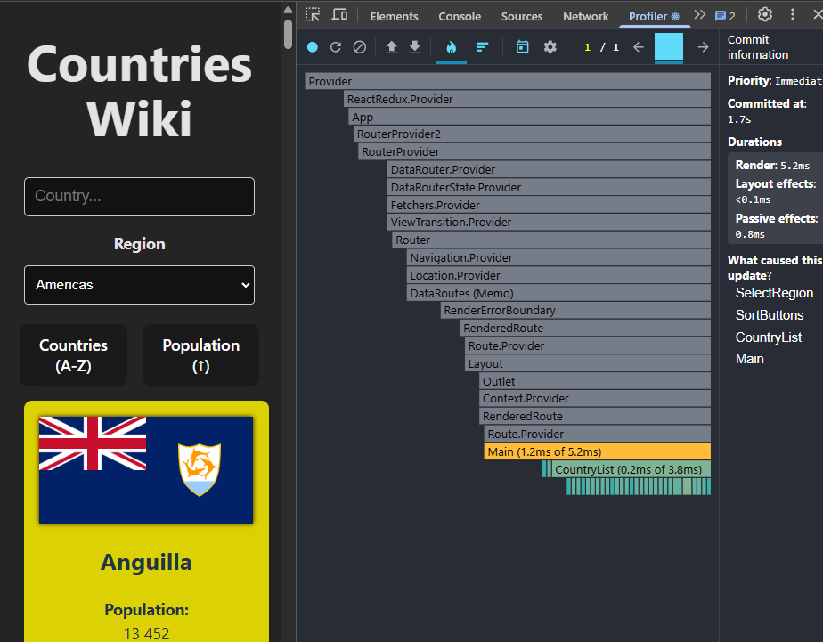
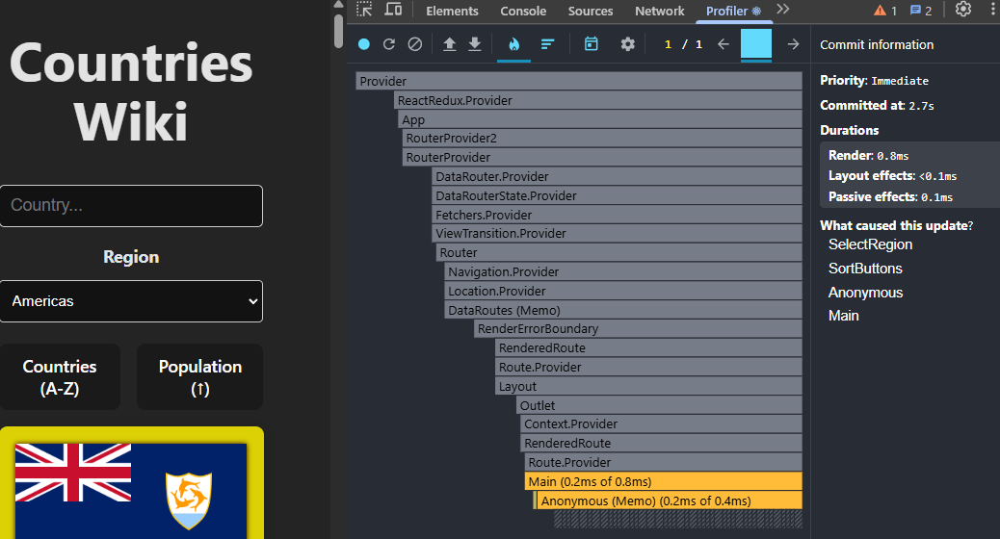
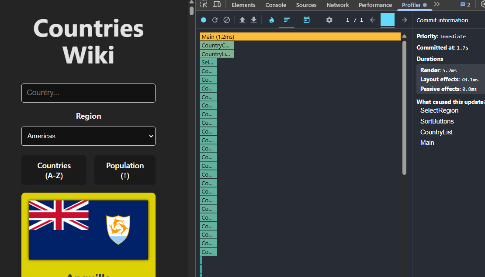
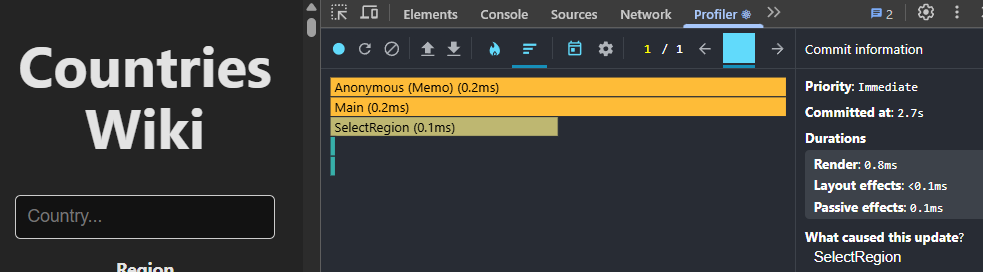
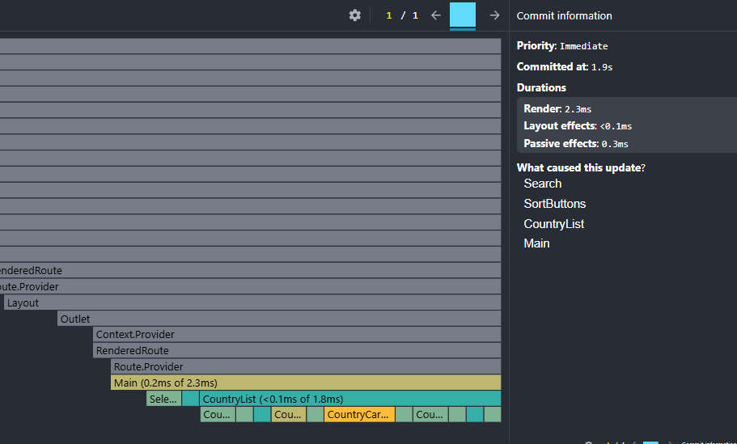
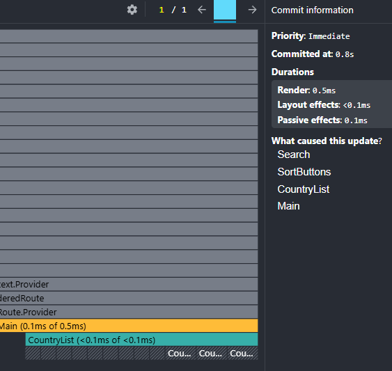
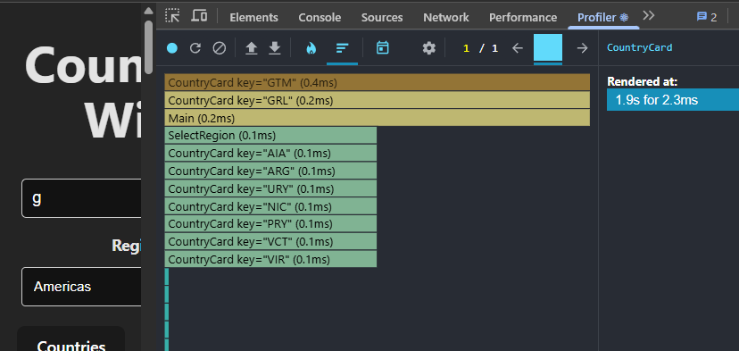
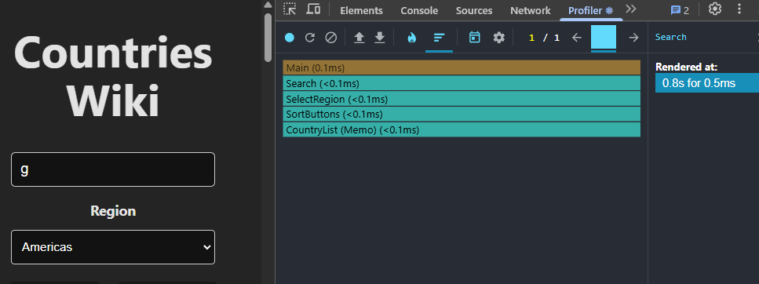

## 🔥 Performance analysis (React Profiler) 📊

### Performance of Region
**Action:** change the region to **"Americas"**
##### 🔥 Flame Graph
**before:**

**after:**

##### 📊 Ranked Chart
**before:**

**after:**

##### ⏳ Region result optimisation

**Render time before optimisation:** 5.2ms  
**Render time after optimisation** 0.8ms 

**Conclusion:** 
 - After optimisation, the rendering time decreased by more than **6.5 times.**
 - **CoutryCard** components are **not re-tenanted** after optimisation
 - Main component render time changed from 1.2ms to 0.2ms - **Main component render 6 times faster**

### Search
**Action:** enter **"g"** into the search input.
#### 🔥 Flame Graph
**before:**

**after:**

### 📊 Ranked Chart
**before:**

**after:**

##### ⏳ Search result optimisation

**Render time before optimisation:** 2.3ms  
**Render time after optimisation** 0.5ms 

**Conclusion:** 
 - After optimisation, the rendering time decreased by more than **4.6 times.**
 - **CoutryCard** components are **not re-tenanted** after optimisation
 - Main component render time changed from 0.2ms to 0.1ms - **Main component render 2 times faster**
